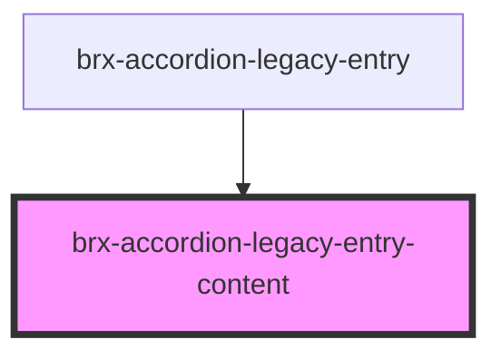

# brx-accordion-legacy-entry-content

<!-- Auto Generated Below -->

## Properties

| Property  | Attribute  | Description | Type     | Default     |
| --------- | ---------- | ----------- | -------- | ----------- |
| `entryId` | `entry-id` |             | `string` | `undefined` |

## Dependencies

### Used by

 - [brx-accordion-legacy-entry](../brx-accordion-legacy-entry)

### Graph

----------------------------------------------

*Built with [StencilJS](https://stenciljs.com/)*
