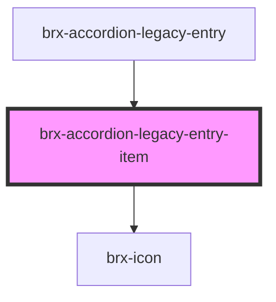

# brx-accordion-legacy-entry-item

<!-- Auto Generated Below -->

## Properties

| Property  | Attribute  | Description | Type      | Default     |
| --------- | ---------- | ----------- | --------- | ----------- |
| `active`  | `active`   |             | `boolean` | `false`     |
| `entryId` | `entry-id` |             | `string`  | `undefined` |

## Events

| Event            | Description | Type                                                  |
| ---------------- | ----------- | ----------------------------------------------------- |
| `collapseChange` |             | `CustomEvent<HTMLBrxAccordionLegacyEntryItemElement>` |

## Dependencies

### Used by

 - [brx-accordion-legacy-entry](../brx-accordion-legacy-entry)

### Depends on

- [brx-icon](../brx-icon)

### Graph

----------------------------------------------

*Built with [StencilJS](https://stenciljs.com/)*
