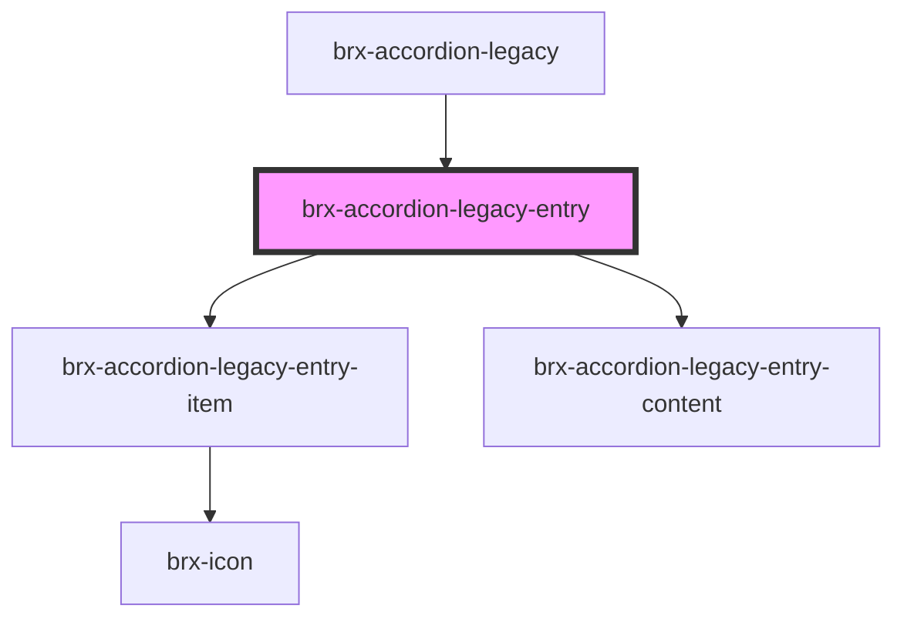

# brx-accordion-legacy-entry

<!-- Auto Generated Below -->

## Properties

| Property      | Attribute      | Description | Type     | Default     |
| ------------- | -------------- | ----------- | -------- | ----------- |
| `content`     | `content`      |             | `string` | `undefined` |
| `entryId`     | `entry-id`     |             | `string` | `undefined` |
| `headerTitle` | `header-title` |             | `string` | `undefined` |

## Dependencies

### Used by

 - [brx-accordion-legacy](../brx-accordion-legacy)

### Depends on

- [brx-accordion-legacy-entry-item](../brx-accordion-legacy-entry-item)
- [brx-accordion-legacy-entry-content](../brx-accordion-legacy-entry-content)

### Graph

----------------------------------------------

*Built with [StencilJS](https://stenciljs.com/)*
