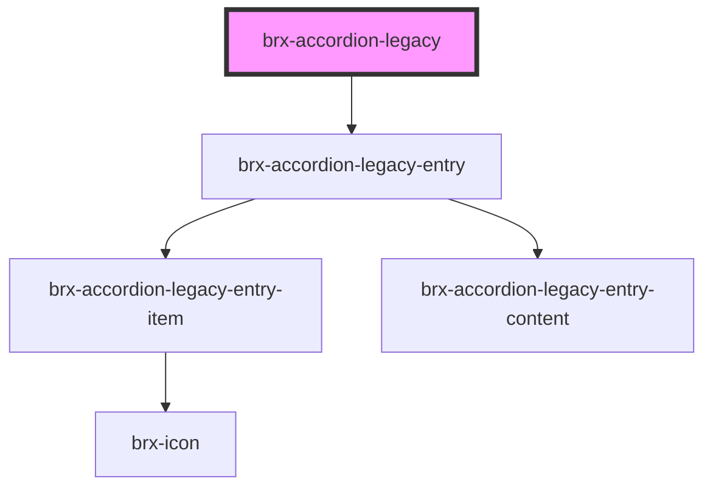

# brx-accordion-legacy

<!-- Auto Generated Below -->

## Properties

| Property   | Attribute  | Description | Type      | Default     |
| ---------- | ---------- | ----------- | --------- | ----------- |
| `entries`  | `entries`  |             | `any`     | `undefined` |
| `negative` | `negative` |             | `boolean` | `false`     |
| `single`   | `single`   |             | `boolean` | `false`     |

## Dependencies

### Depends on

- [brx-accordion-legacy-entry](../brx-accordion-legacy-entry)

### Graph

----------------------------------------------

*Built with [StencilJS](https://stenciljs.com/)*
