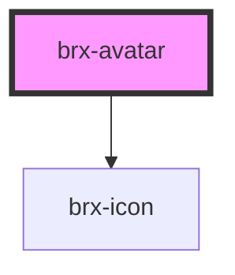

# brx-avatar

<!-- Auto Generated Below -->

## Properties

| Property       | Attribute       | Description | Type                             | Default     |
| -------------- | --------------- | ----------- | -------------------------------- | ----------- |
| `alt`          | `alt`           |             | `string`                         | `undefined` |
| `contentClass` | `content-class` |             | `string`                         | `undefined` |
| `mode`         | `mode`          |             | `"icon" \| "name" \| "picture"`  | `undefined` |
| `name`         | `name`          |             | `string`                         | `undefined` |
| `size`         | `size`          |             | `"large" \| "medium" \| "small"` | `'small'`   |
| `src`          | `src`           |             | `string`                         | `undefined` |

## Dependencies

### Depends on

- [brx-icon](../brx-icon)

### Graph

----------------------------------------------

*Built with [StencilJS](https://stenciljs.com/)*
