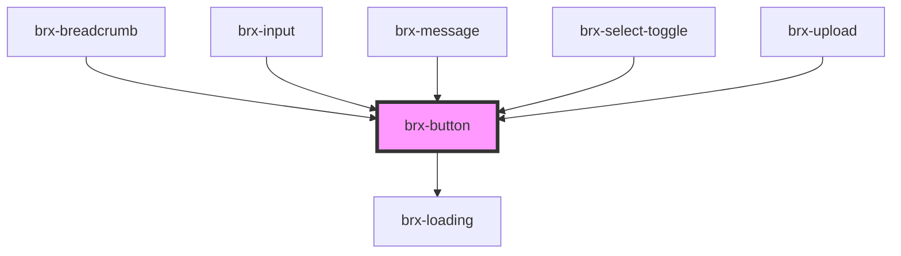

# brx-button

<!-- Auto Generated Below -->

## Properties

| Property      | Attribute      | Description                                                                                                                                                                                                                                                                               | Type                                           | Default     |
| ------------- | -------------- | ----------------------------------------------------------------------------------------------------------------------------------------------------------------------------------------------------------------------------------------------------------------------------------------- | ---------------------------------------------- | ----------- |
| `active`      | `active`       |                                                                                                                                                                                                                                                                                           | `boolean`                                      | `false`     |
| `block`       | `block`        |                                                                                                                                                                                                                                                                                           | `boolean`                                      | `false`     |
| `buttonType`  | `button-type`  | The type of button.                                                                                                                                                                                                                                                                       | `string`                                       | `'button'`  |
| `circle`      | `circle`       |                                                                                                                                                                                                                                                                                           | `boolean`                                      | `false`     |
| `color`       | `color`        |                                                                                                                                                                                                                                                                                           | `"danger" \| "info" \| "success" \| "warning"` | `undefined` |
| `darkMode`    | `dark-mode`    |                                                                                                                                                                                                                                                                                           | `boolean`                                      | `false`     |
| `disabled`    | `disabled`     | If `true`, the user cannot interact with the button.                                                                                                                                                                                                                                      | `boolean`                                      | `false`     |
| `download`    | `download`     | This attribute instructs browsers to download a URL instead of navigating to it, so the user will be prompted to save it as a local file. If the attribute has a value, it is used as the pre-filled file name in the Save prompt (the user can still change the file name if they want). | `string`                                       | `undefined` |
| `href`        | `href`         | Contains a URL or a URL fragment that the hyperlink points to. If this property is set, an anchor tag will be rendered.                                                                                                                                                                   | `string`                                       | `undefined` |
| `loading`     | `loading`      |                                                                                                                                                                                                                                                                                           | `boolean`                                      | `false`     |
| `magic`       | `magic`        |                                                                                                                                                                                                                                                                                           | `boolean`                                      | `false`     |
| `nativeClass` | `native-class` | CSS class names to be applied to the native button element.                                                                                                                                                                                                                               | `string`                                       | `''`        |
| `rel`         | `rel`          | Specifies the relationship of the target object to the link object. The value is a space-separated list of [link types](https://developer.mozilla.org/en-US/docs/Web/HTML/Link_types).                                                                                                    | `string`                                       | `undefined` |
| `signin`      | `signin`       |                                                                                                                                                                                                                                                                                           | `"avatar" \| boolean`                          | `false`     |
| `size`        | `size`         |                                                                                                                                                                                                                                                                                           | `"large" \| "medium" \| "small" \| "xsmall"`   | `'medium'`  |
| `strong`      | `strong`       | If `true`, activates a button with a heavier font weight.                                                                                                                                                                                                                                 | `boolean`                                      | `false`     |
| `target`      | `target`       | Specifies where to display the linked URL. Only applies when an `href` is provided. Special keywords: `"_blank"`, `"_self"`, `"_parent"`, `"_top"`.                                                                                                                                       | `string`                                       | `undefined` |
| `type`        | `type`         | The type of the button.                                                                                                                                                                                                                                                                   | `"button" \| "reset" \| "submit"`              | `'button'`  |
| `variant`     | `variant`      |                                                                                                                                                                                                                                                                                           | `"default" \| "primary" \| "secondary"`        | `'default'` |

## Events

| Event      | Description                          | Type                |
| ---------- | ------------------------------------ | ------------------- |
| `brxBlur`  | Emitted when the button loses focus. | `CustomEvent<void>` |
| `brxFocus` | Emitted when the button has focus.   | `CustomEvent<void>` |

## Dependencies

### Used by

 - [brx-breadcrumb](../brx-breadcrumb)
 - [brx-input](../brx-input)
 - [brx-message](../brx-message)
 - [brx-select-toggle](../brx-select-toggle)
 - [brx-upload](../brx-upload)

### Depends on

- [brx-loading](../brx-loading)

### Graph

----------------------------------------------

*Built with [StencilJS](https://stenciljs.com/)*
