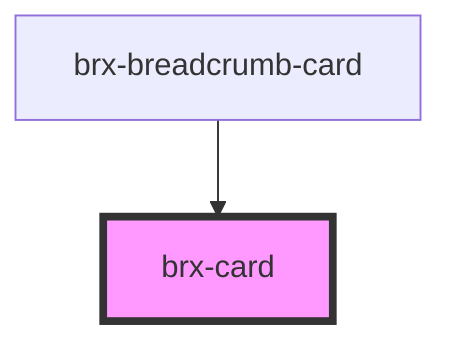

# brx-card

<!-- Auto Generated Below -->

## Properties

| Property   | Attribute   | Description | Type      | Default |
| ---------- | ----------- | ----------- | --------- | ------- |
| `darkMode` | `dark-mode` |             | `boolean` | `false` |
| `disabled` | `disabled`  |             | `boolean` | `false` |
| `hFixed`   | `h-fixed`   |             | `boolean` | `false` |
| `hover`    | `hover`     |             | `boolean` | `false` |

## Methods

### `syncDisabledState() => Promise<void>`

#### Returns

Type: `Promise<void>`

## Dependencies

### Used by

 - [brx-breadcrumb-card](../brx-breadcrumb-card)

### Graph

----------------------------------------------

*Built with [StencilJS](https://stenciljs.com/)*
