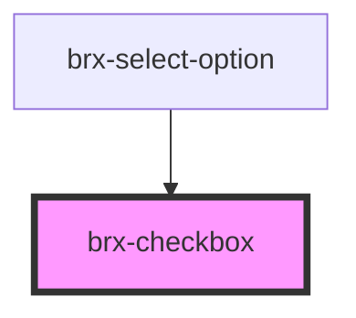

# brx-checkbox

<!-- Auto Generated Below -->

## Properties

| Property            | Attribute            | Description                                                                                                                                                                                                                                                  | Type                               | Default                |
| ------------------- | -------------------- | ------------------------------------------------------------------------------------------------------------------------------------------------------------------------------------------------------------------------------------------------------------ | ---------------------------------- | ---------------------- |
| `checkAllLabel`     | `check-all-label`    |                                                                                                                                                                                                                                                              | `string`                           | `'Selecionar tudo'`    |
| `checked`           | `checked`            | If `true`, the checkbox is selected.                                                                                                                                                                                                                         | `boolean`                          | `null`                 |
| `child`             | `child`              |                                                                                                                                                                                                                                                              | `string`                           | `undefined`            |
| `controlledChecked` | `controlled-checked` |                                                                                                                                                                                                                                                              | `boolean`                          | `TOKEN_UNCONTROLLED`   |
| `danger`            | `danger`             |                                                                                                                                                                                                                                                              | `boolean`                          | `undefined`            |
| `darkMode`          | `dark-mode`          |                                                                                                                                                                                                                                                              | `boolean`                          | `false`                |
| `disabled`          | `disabled`           | If `true`, the user cannot interact with the checkbox.                                                                                                                                                                                                       | `boolean`                          | `false`                |
| `hiddenLabel`       | `hidden-label`       |                                                                                                                                                                                                                                                              | `boolean`                          | `false`                |
| `indeterminate`     | `indeterminate`      | If `true`, the checkbox will visually appear as indeterminate.                                                                                                                                                                                               | `boolean`                          | `false`                |
| `inputId`           | `input-id`           |                                                                                                                                                                                                                                                              | `string`                           | `undefined`            |
| `invalid`           | `invalid`            |                                                                                                                                                                                                                                                              | `boolean`                          | `undefined`            |
| `label`             | `label`              |                                                                                                                                                                                                                                                              | `string`                           | `undefined`            |
| `name`              | `name`               | The name of the control, which is submitted with the form data.                                                                                                                                                                                              | `string`                           | `undefined`            |
| `propParent`        | `parent`             |                                                                                                                                                                                                                                                              | `boolean \| string`                | `undefined`            |
| `size`              | `size`               |                                                                                                                                                                                                                                                              | `"medium" \| "small"`              | `'medium'`             |
| `state`             | `state`              |                                                                                                                                                                                                                                                              | `"danger" \| "invalid" \| "valid"` | `undefined`            |
| `uncheckAllLabel`   | `uncheck-all-label`  |                                                                                                                                                                                                                                                              | `string`                           | `'Desselecionar tudo'` |
| `valid`             | `valid`              |                                                                                                                                                                                                                                                              | `boolean`                          | `undefined`            |
| `value`             | `value`              | The value of the checkbox does not mean if it's checked or not, use the `checked` property for that.  The value of a checkbox is analogous to the value of an `<input type="checkbox">`, it's only used when the checkbox participates in a native `<form>`. | `any`                              | `'on'`                 |

## Events

| Event       | Description                                    | Type                                             |
| ----------- | ---------------------------------------------- | ------------------------------------------------ |
| `brxBlur`   | Emitted when the checkbox loses focus.         | `CustomEvent<void>`                              |
| `brxChange` | Emitted when the checked property has changed. | `CustomEvent<CheckboxChangeEventDetail<string>>` |
| `brxFocus`  | Emitted when the checkbox has focus.           | `CustomEvent<void>`                              |
| `brxUpdate` | Emitted when the state has changed.            | `CustomEvent<CheckboxUpdateEventDetail<string>>` |

## Methods

### `getCurrentState() => Promise<{ value: any; checked: boolean; indeterminate: boolean; }>`

#### Returns

Type: `Promise<{ value: any; checked: boolean; indeterminate: boolean; }>`

### `getNativeChecked() => Promise<boolean>`

#### Returns

Type: `Promise<boolean>`

### `setState(checked: boolean, indeterminate: boolean) => Promise<void>`

#### Returns

Type: `Promise<void>`

## Dependencies

### Used by

 - [brx-select-option](../brx-select-option)

### Graph

----------------------------------------------

*Built with [StencilJS](https://stenciljs.com/)*
