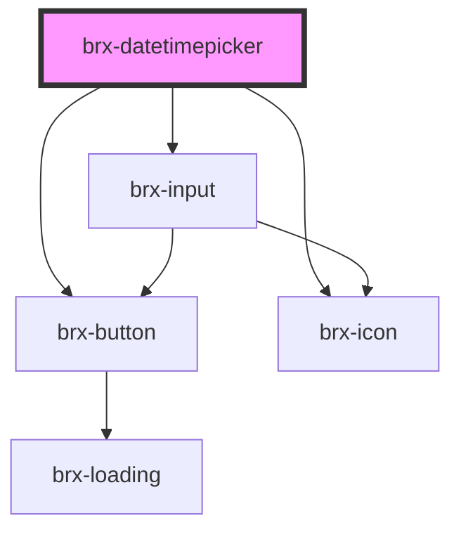

# brx-datetimepicker

<!-- Auto Generated Below -->

## Properties

| Property          | Attribute          | Description | Type                                                                                                                                                                                                                                                                                                                                                                                                                                                                                                                                                                                                                                                                                                                                                                                                                                                                                                                                                                                                                                                                                                                                                                                                                                                                                                                                                                                                                                                                                                                                                                                                                                                                                                                                                                                                                                                                                                                                                                                                                                                    | Default              |
| ----------------- | ------------------ | ----------- | ------------------------------------------------------------------------------------------------------------------------------------------------------------------------------------------------------------------------------------------------------------------------------------------------------------------------------------------------------------------------------------------------------------------------------------------------------------------------------------------------------------------------------------------------------------------------------------------------------------------------------------------------------------------------------------------------------------------------------------------------------------------------------------------------------------------------------------------------------------------------------------------------------------------------------------------------------------------------------------------------------------------------------------------------------------------------------------------------------------------------------------------------------------------------------------------------------------------------------------------------------------------------------------------------------------------------------------------------------------------------------------------------------------------------------------------------------------------------------------------------------------------------------------------------------------------------------------------------------------------------------------------------------------------------------------------------------------------------------------------------------------------------------------------------------------------------------------------------------------------------------------------------------------------------------------------------------------------------------------------------------------------------------------------------------- | -------------------- |
| `config`          | `config`           |             | `string \| ({ allowInput?: boolean; allowInvalidPreload?: boolean; altFormat?: string; altInput?: boolean; altInputClass?: string; animate?: boolean; appendTo?: HTMLElement; ariaDateFormat?: string; autoFillDefaultTime?: boolean; clickOpens?: boolean; closeOnSelect?: boolean; conjunction?: string; dateFormat?: string; defaultDate?: DateOption \| DateOption[]; defaultHour?: number; defaultMinute?: number; defaultSeconds?: number; disable?: DateLimit<DateOption>[]; disableMobile?: boolean; enable?: DateLimit<DateOption>[]; enableSeconds?: boolean; enableTime?: boolean; errorHandler?: (e: Error) => void; formatDate?: (date: Date, format: string, locale: Locale) => string; getWeek?: (date: Date) => string \| number; hourIncrement?: number; ignoredFocusElements?: HTMLElement[]; inline?: boolean; locale?: key \| Partial<CustomLocale>; maxDate?: DateOption; maxTime?: DateOption; minDate?: DateOption; minTime?: DateOption; minuteIncrement?: number; mode?: "time" \| "single" \| "multiple" \| "range"; monthSelectorType?: "static" \| "dropdown"; nextArrow?: string; noCalendar?: boolean; now?: DateOption; onChange?: Hook \| Hook[]; onClose?: Hook \| Hook[]; onDayCreate?: Hook \| Hook[]; onDestroy?: Hook \| Hook[]; onKeyDown?: Hook \| Hook[]; onMonthChange?: Hook \| Hook[]; onOpen?: Hook \| Hook[]; onParseConfig?: Hook \| Hook[]; onReady?: Hook \| Hook[]; onValueUpdate?: Hook \| Hook[]; onYearChange?: Hook \| Hook[]; onPreCalendarPosition?: Hook \| Hook[]; parseDate?: (date: string, format: string) => Date; plugins?: Plugin<{}>[]; position?: "auto" \| "above" \| "below" \| "auto left" \| "auto center" \| "auto right" \| "above left" \| "above center" \| "above right" \| "below left" \| "below center" \| "below right" \| ((self: Instance, customElement: HTMLElement) => void); positionElement?: Element; prevArrow?: string; shorthandCurrentMonth?: boolean; static?: boolean; showMonths?: number; time_24hr?: boolean; weekNumbers?: boolean; wrap?: boolean; })` | `undefined`          |
| `controlledValue` | `controlled-value` |             | `string`                                                                                                                                                                                                                                                                                                                                                                                                                                                                                                                                                                                                                                                                                                                                                                                                                                                                                                                                                                                                                                                                                                                                                                                                                                                                                                                                                                                                                                                                                                                                                                                                                                                                                                                                                                                                                                                                                                                                                                                                                                                | `TOKEN_UNCONTROLLED` |
| `mode`            | `mode`             |             | `"range" \| "single"`                                                                                                                                                                                                                                                                                                                                                                                                                                                                                                                                                                                                                                                                                                                                                                                                                                                                                                                                                                                                                                                                                                                                                                                                                                                                                                                                                                                                                                                                                                                                                                                                                                                                                                                                                                                                                                                                                                                                                                                                                                   | `'single'`           |
| `placeholder`     | `placeholder`      |             | `string`                                                                                                                                                                                                                                                                                                                                                                                                                                                                                                                                                                                                                                                                                                                                                                                                                                                                                                                                                                                                                                                                                                                                                                                                                                                                                                                                                                                                                                                                                                                                                                                                                                                                                                                                                                                                                                                                                                                                                                                                                                                | `undefined`          |
| `type`            | `type`             |             | `Type.DATE \| Type.DATETIME_LOCAL \| Type.TIME`                                                                                                                                                                                                                                                                                                                                                                                                                                                                                                                                                                                                                                                                                                                                                                                                                                                                                                                                                                                                                                                                                                                                                                                                                                                                                                                                                                                                                                                                                                                                                                                                                                                                                                                                                                                                                                                                                                                                                                                                         | `undefined`          |
| `value`           | `value`            |             | `string`                                                                                                                                                                                                                                                                                                                                                                                                                                                                                                                                                                                                                                                                                                                                                                                                                                                                                                                                                                                                                                                                                                                                                                                                                                                                                                                                                                                                                                                                                                                                                                                                                                                                                                                                                                                                                                                                                                                                                                                                                                                | `undefined`          |

## Dependencies

### Depends on

- [brx-input](../brx-input)
- [brx-button](../brx-button)
- [brx-icon](../brx-icon)

### Graph

----------------------------------------------

*Built with [StencilJS](https://stenciljs.com/)*
