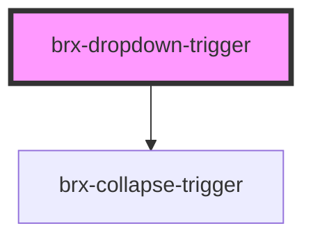

# brx-dropdown-trigger

<!-- Auto Generated Below -->

## Properties

| Property     | Attribute      | Description | Type                    | Default                  |
| ------------ | -------------- | ----------- | ----------------------- | ------------------------ |
| `breakpoint` | `breakpoint`   |             | `string`                | `undefined`              |
| `iconToHide` | `icon-to-hide` |             | `string`                | `'fa5/fas/chevron-up'`   |
| `iconToShow` | `icon-to-show` |             | `string`                | `'fa5/fas/chevron-down'` |
| `propTarget` | `target`       |             | `HTMLElement \| string` | `undefined`              |
| `useIcons`   | `use-icons`    |             | `boolean`               | `true`                   |

## Dependencies

### Depends on

- [brx-collapse-trigger](../brx-collapse-trigger)

### Graph

----------------------------------------------

*Built with [StencilJS](https://stenciljs.com/)*
