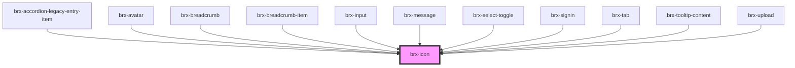

# brx-icon

<!-- Auto Generated Below -->

## Properties

| Property        | Attribute        | Description                                    | Type      | Default     |
| --------------- | ---------------- | ---------------------------------------------- | --------- | ----------- |
| `iconClass`     | `icon-class`     |                                                | `string`  | `undefined` |
| `loadResources` | `load-resources` | Define o carregamento automático dos recursos. | `boolean` | `true`      |
| `name`          | `name`           | O nome do ícone. bicycle -> fa5/fas/bicycle    | `string`  | `undefined` |

## Dependencies

### Used by

 - [brx-accordion-legacy-entry-item](../brx-accordion-legacy-entry-item)
 - [brx-avatar](../brx-avatar)
 - [brx-breadcrumb](../brx-breadcrumb)
 - [brx-breadcrumb-item](../brx-breadcrumb-item)
 - [brx-input](../brx-input)
 - [brx-message](../brx-message)
 - [brx-select-toggle](../brx-select-toggle)
 - [brx-signin](../brx-signin)
 - [brx-tab](../brx-tab)
 - [brx-tooltip-content](../brx-tooltip-content)
 - [brx-upload](../brx-upload)

### Graph

----------------------------------------------

*Built with [StencilJS](https://stenciljs.com/)*
