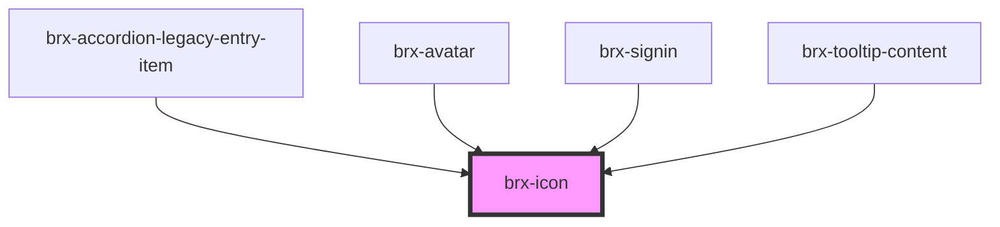

# brx-icon

<!-- Auto Generated Below -->

## Properties

| Property        | Attribute        | Description                                    | Type      | Default     |
| --------------- | ---------------- | ---------------------------------------------- | --------- | ----------- |
| `loadResources` | `load-resources` | Define o carregamento automático dos recursos. | `boolean` | `true`      |
| `name`          | `name`           | O nome do ícone. bicycle -> fa5/fas/bicycle    | `string`  | `undefined` |

## Dependencies

### Used by

 - [brx-accordion-legacy-entry-item](../brx-accordion-legacy-entry-item)
 - [brx-avatar](../brx-avatar)
 - [brx-signin](../brx-signin)
 - [brx-tooltip-content](../brx-tooltip-content)

### Graph

----------------------------------------------

*Built with [StencilJS](https://stenciljs.com/)*
