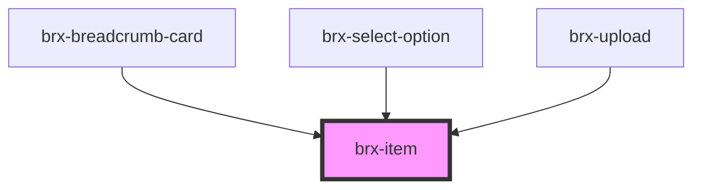

# brx-item

<!-- Auto Generated Below -->

## Properties

| Property   | Attribute  | Description | Type      | Default     |
| ---------- | ---------- | ----------- | --------- | ----------- |
| `button`   | `button`   |             | `boolean` | `undefined` |
| `disabled` | `disabled` |             | `boolean` | `undefined` |
| `selected` | `selected` |             | `boolean` | `undefined` |

## Dependencies

### Used by

 - [brx-breadcrumb-card](../brx-breadcrumb-card)
 - [brx-select-option](../brx-select-option)
 - [brx-upload](../brx-upload)

### Graph

----------------------------------------------

*Built with [StencilJS](https://stenciljs.com/)*
