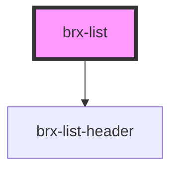

# brx-list-header

<!-- Auto Generated Below -->

## Properties

| Property      | Attribute      | Description | Type                        | Default     |
| ------------- | -------------- | ----------- | --------------------------- | ----------- |
| `headerTitle` | `header-title` |             | `string`                    | `undefined` |
| `horizontal`  | `horizontal`   |             | `boolean`                   | `undefined` |
| `lines`       | `lines`        |             | `"one" \| "three" \| "two"` | `undefined` |

## Dependencies

### Depends on

- [brx-list-header](../brx-list-header)

### Graph

----------------------------------------------

*Built with [StencilJS](https://stenciljs.com/)*
