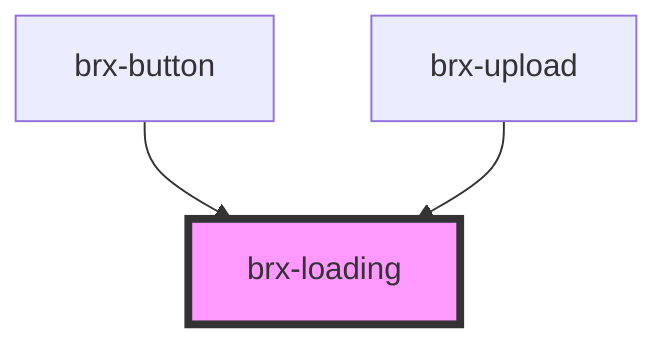

# brx-loading

<!-- Auto Generated Below -->

## Properties

| Property   | Attribute  | Description | Type               | Default     |
| ---------- | ---------- | ----------- | ------------------ | ----------- |
| `progress` | `progress` |             | `number \| string` | `undefined` |
| `size`     | `size`     |             | `string`           | `'medium'`  |
| `variant`  | `variant`  |             | `string`           | `undefined` |

## Dependencies

### Used by

 - [brx-button](../brx-button)
 - [brx-upload](../brx-upload)

### Graph

----------------------------------------------

*Built with [StencilJS](https://stenciljs.com/)*
