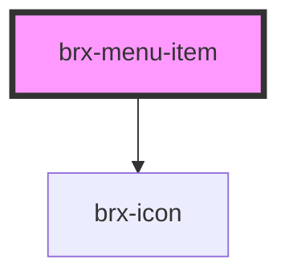

# brx-menu-item

<!-- Auto Generated Below -->

## Properties

| Property       | Attribute       | Description | Type      | Default |
| -------------- | --------------- | ----------- | --------- | ------- |
| `initialSetup` | `initial-setup` |             | `boolean` | `true`  |

## Methods

### `hide() => Promise<void>`

#### Returns

Type: `Promise<void>`

### `setupParent() => Promise<void>`

#### Returns

Type: `Promise<void>`

### `show() => Promise<void>`

#### Returns

Type: `Promise<void>`

## Dependencies

### Depends on

- [brx-icon](../brx-icon)

### Graph

----------------------------------------------

*Built with [StencilJS](https://stenciljs.com/)*
