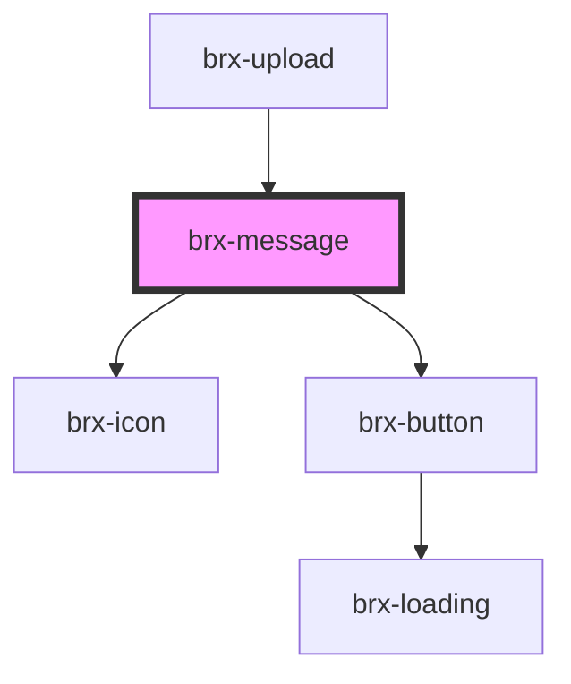

# brx-message

<!-- Auto Generated Below -->

## Properties

| Property       | Attribute       | Description | Type                                           | Default     |
| -------------- | --------------- | ----------- | ---------------------------------------------- | ----------- |
| `dismissable`  | `dismissable`   |             | `boolean`                                      | `undefined` |
| `messageTitle` | `message-title` |             | `string`                                       | `undefined` |
| `severity`     | `severity`      |             | `"danger" \| "info" \| "success" \| "warning"` | `'info'`    |
| `variant`      | `variant`       |             | `"feedback" \| "message"`                      | `'message'` |

## Methods

### `dismiss() => Promise<void>`

#### Returns

Type: `Promise<void>`

## Dependencies

### Used by

 - [brx-upload](../brx-upload)

### Depends on

- [brx-icon](../brx-icon)
- [brx-button](../brx-button)

### Graph

----------------------------------------------

*Built with [StencilJS](https://stenciljs.com/)*
