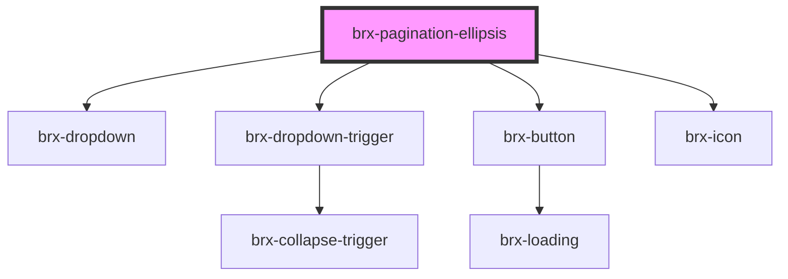

# brx-pagination-ellipsis

<!-- Auto Generated Below -->

## Properties

| Property     | Attribute     | Description | Type     | Default     |
| ------------ | ------------- | ----------- | -------- | ----------- |
| `dropdownId` | `dropdown-id` |             | `string` | `undefined` |

## Dependencies

### Depends on

- [brx-dropdown](../brx-dropdown)
- [brx-dropdown-trigger](../brx-dropdown-trigger)
- [brx-button](../brx-button)
- [brx-icon](../brx-icon)

### Graph

----------------------------------------------

*Built with [StencilJS](https://stenciljs.com/)*
