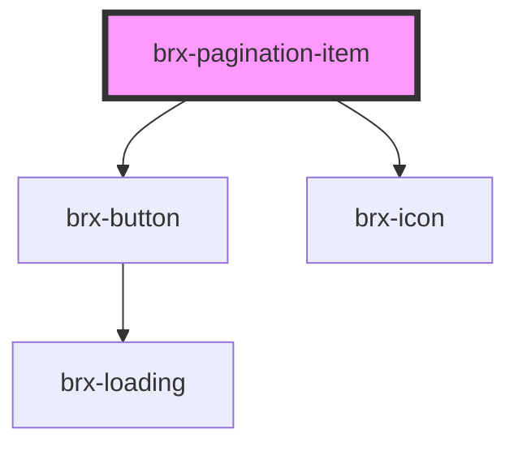

# brx-pagination-item

<!-- Auto Generated Below -->

## Properties

| Property   | Attribute  | Description | Type                                              | Default     |
| ---------- | ---------- | ----------- | ------------------------------------------------- | ----------- |
| `_target`  | `target`   |             | `"first" \| "last" \| "next" \| "prev" \| number` | `undefined` |
| `active`   | `active`   |             | `boolean`                                         | `undefined` |
| `disabled` | `disabled` |             | `boolean`                                         | `undefined` |

## Methods

### `getTarget() => Promise<number | "first" | "prev" | "next" | "last">`

#### Returns

Type: `Promise<number | "first" | "prev" | "next" | "last">`

## Dependencies

### Depends on

- [brx-button](../brx-button)
- [brx-icon](../brx-icon)

### Graph

----------------------------------------------

*Built with [StencilJS](https://stenciljs.com/)*
