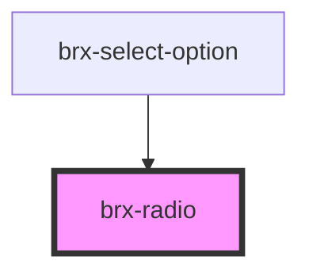

# brx-radio

<!-- Auto Generated Below -->

## Properties

| Property            | Attribute            | Description                                                     | Type      | Default              |
| ------------------- | -------------------- | --------------------------------------------------------------- | --------- | -------------------- |
| `checked`           | `checked`            | If `true`, the radio is selected.                               | `boolean` | `undefined`          |
| `controlledChecked` | `controlled-checked` |                                                                 | `boolean` | `TOKEN_UNCONTROLLED` |
| `disabled`          | `disabled`           | If `true`, the user cannot interact with the radio.             | `boolean` | `false`              |
| `inputId`           | `input-id`           |                                                                 | `string`  | `undefined`          |
| `label`             | `label`              |                                                                 | `string`  | `undefined`          |
| `name`              | `name`               | The name of the control, which is submitted with the form data. | `string`  | `undefined`          |
| `value`             | `value`              | the value of the radio.                                         | `any`     | `undefined`          |

## Events

| Event       | Description                                | Type                                          |
| ----------- | ------------------------------------------ | --------------------------------------------- |
| `brxBlur`   | Emitted when the radio button loses focus. | `CustomEvent<void>`                           |
| `brxChange` |                                            | `CustomEvent<RadioChangeEventDetail<string>>` |
| `brxFocus`  | Emitted when the radio button has focus.   | `CustomEvent<void>`                           |
| `brxUpdate` |                                            | `CustomEvent<RadioUpdateEventDetail<string>>` |

## Methods

### `getCurrentState() => Promise<{ value: any; checked: boolean; }>`

#### Returns

Type: `Promise<{ value: any; checked: boolean; }>`

### `setButtonTabindex(value: number) => Promise<void>`

#### Returns

Type: `Promise<void>`

### `setFocus() => Promise<void>`

#### Returns

Type: `Promise<void>`

## Dependencies

### Used by

 - [brx-select-option](../brx-select-option)

### Graph

----------------------------------------------

*Built with [StencilJS](https://stenciljs.com/)*
