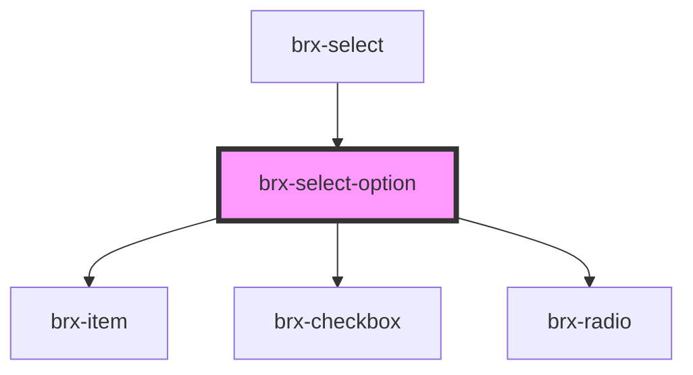

# brx-select-option

<!-- Auto Generated Below -->

## Properties

| Property   | Attribute  | Description | Type      | Default     |
| ---------- | ---------- | ----------- | --------- | ----------- |
| `checked`  | `checked`  |             | `boolean` | `false`     |
| `inputId`  | `input-id` |             | `string`  | `undefined` |
| `label`    | `label`    |             | `string`  | `undefined` |
| `multiple` | `multiple` |             | `boolean` | `false`     |
| `value`    | `value`    |             | `string`  | `undefined` |
| `visible`  | `visible`  |             | `boolean` | `true`      |

## Events

| Event                   | Description | Type                                         |
| ----------------------- | ----------- | -------------------------------------------- |
| `brxSelectOptionChange` |             | `CustomEvent<SelectOptionChangeEventDetail>` |

## Dependencies

### Used by

 - [brx-select](../brx-select)

### Depends on

- [brx-item](../brx-item)
- [brx-checkbox](../brx-checkbox)
- [brx-radio](../brx-radio)

### Graph

----------------------------------------------

*Built with [StencilJS](https://stenciljs.com/)*
