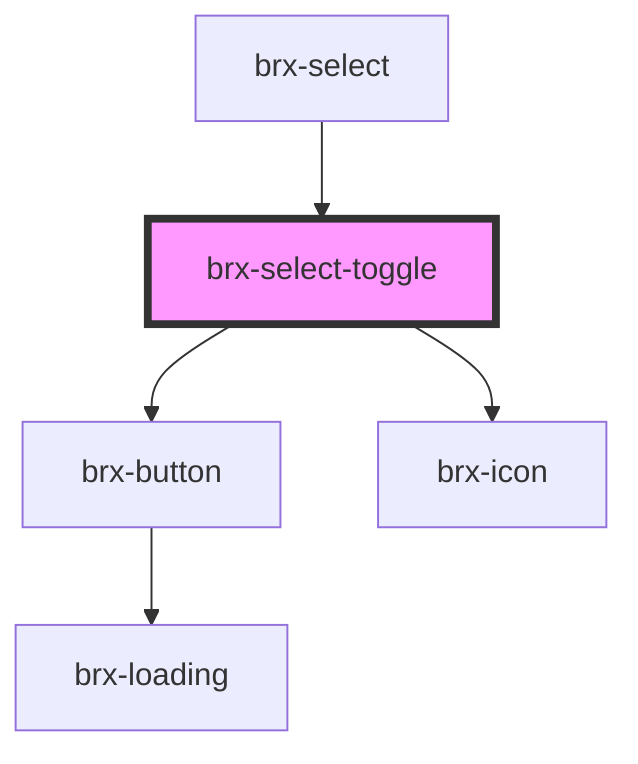

# brx-select-toggle

<!-- Auto Generated Below -->

## Properties

| Property   | Attribute  | Description | Type      | Default |
| ---------- | ---------- | ----------- | --------- | ------- |
| `expanded` | `expanded` |             | `boolean` | `false` |

## Dependencies

### Used by

 - [brx-select](../brx-select)

### Depends on

- [brx-button](../brx-button)
- [brx-icon](../brx-icon)

### Graph

----------------------------------------------

*Built with [StencilJS](https://stenciljs.com/)*
