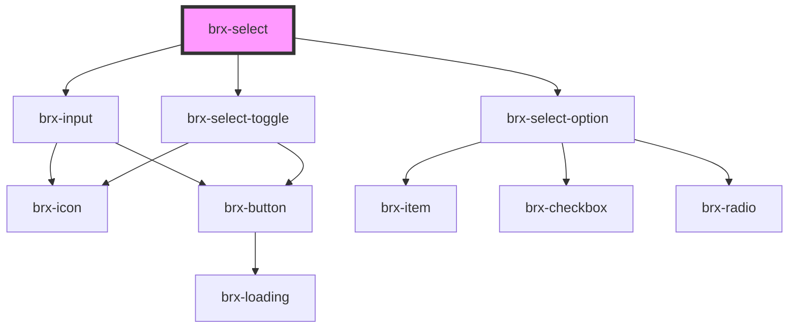

# brx-select

<!-- Auto Generated Below -->

## Properties

| Property           | Attribute            | Description                                                     | Type       | Default                |
| ------------------ | -------------------- | --------------------------------------------------------------- | ---------- | ---------------------- |
| `controlledValue`  | --                   |                                                                 | `string[]` | `TOKEN_UNCONTROLLED`   |
| `darkMode`         | `dark-mode`          |                                                                 | `boolean`  | `false`                |
| `disableToggleAll` | `disable-toggle-all` |                                                                 | `boolean`  | `false`                |
| `inputId`          | `input-id`           |                                                                 | `string`   | `undefined`            |
| `label`            | `label`              |                                                                 | `string`   | `undefined`            |
| `multiple`         | `multiple`           |                                                                 | `boolean`  | `false`                |
| `name`             | `name`               | The name of the control, which is submitted with the form data. | `string`   | `undefined`            |
| `nativeSelect`     | `native-select`      |                                                                 | `boolean`  | `null`                 |
| `selectAllLabel`   | `select-all-label`   |                                                                 | `string`   | `'Selecionar Todos'`   |
| `unselectAllLabel` | `unselect-all-label` |                                                                 | `string`   | `'Deselecionar Todos'` |
| `value`            | --                   |                                                                 | `string[]` | `[]`                   |

## Events

| Event                  | Description | Type                                              |
| ---------------------- | ----------- | ------------------------------------------------- |
| `brxChange`            |             | `CustomEvent<SelectChangeEventDetail<string>>`    |
| `brxFilterInputChange` |             | `CustomEvent<SelectFilterInputChangeEventDetail>` |

## Dependencies

### Depends on

- [brx-input](../brx-input)
- [brx-select-toggle](../brx-select-toggle)
- [brx-select-option](../brx-select-option)

### Graph

----------------------------------------------

*Built with [StencilJS](https://stenciljs.com/)*
