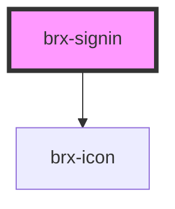

# brx-signin

<!-- Auto Generated Below -->

## Properties

| Property    | Attribute    | Description | Type      | Default          |
| ----------- | ------------ | ----------- | --------- | ---------------- |
| `iconName`  | `icon-name`  |             | `string`  | `'fa5/fas/user'` |
| `label`     | `label`      |             | `string`  | `'Entrar'`       |
| `showIcon`  | `show-icon`  |             | `boolean` | `true`           |
| `showLabel` | `show-label` |             | `boolean` | `true`           |

## Dependencies

### Depends on

- [brx-icon](../brx-icon)

### Graph

----------------------------------------------

*Built with [StencilJS](https://stenciljs.com/)*
