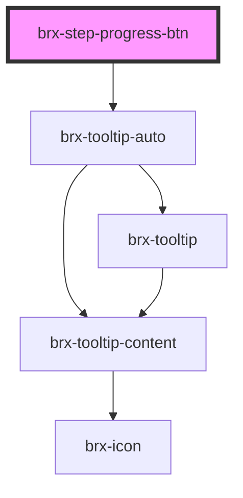

# brx-step-progress-btn

<!-- Auto Generated Below -->

## Properties

| Property      | Attribute      | Description | Type                                           | Default     |
| ------------- | -------------- | ----------- | ---------------------------------------------- | ----------- |
| `active`      | `active`       |             | `boolean`                                      | `undefined` |
| `alert`       | `alert`        |             | `"danger" \| "info" \| "success" \| "warning"` | `undefined` |
| `disabled`    | `disabled`     |             | `boolean`                                      | `undefined` |
| `stepNum`     | `step-num`     |             | `string`                                       | `undefined` |
| `tooltipText` | `tooltip-text` |             | `string`                                       | `undefined` |

## Dependencies

### Depends on

- [brx-tooltip-auto](../brx-tooltip-auto)

### Graph

----------------------------------------------

*Built with [StencilJS](https://stenciljs.com/)*
