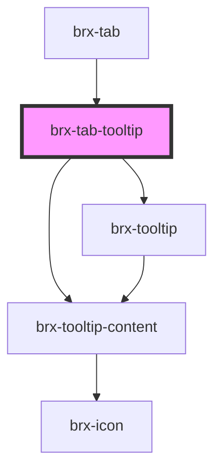

# brx-tab-tooltip

<!-- Auto Generated Below -->

## Properties

| Property      | Attribute      | Description | Type     | Default     |
| ------------- | -------------- | ----------- | -------- | ----------- |
| `tooltipText` | `tooltip-text` |             | `string` | `undefined` |

## Dependencies

### Used by

 - [brx-tab](.)

### Depends on

- [brx-tooltip](../brx-tooltip)
- [brx-tooltip-content](../brx-tooltip-content)

### Graph

----------------------------------------------

*Built with [StencilJS](https://stenciljs.com/)*
