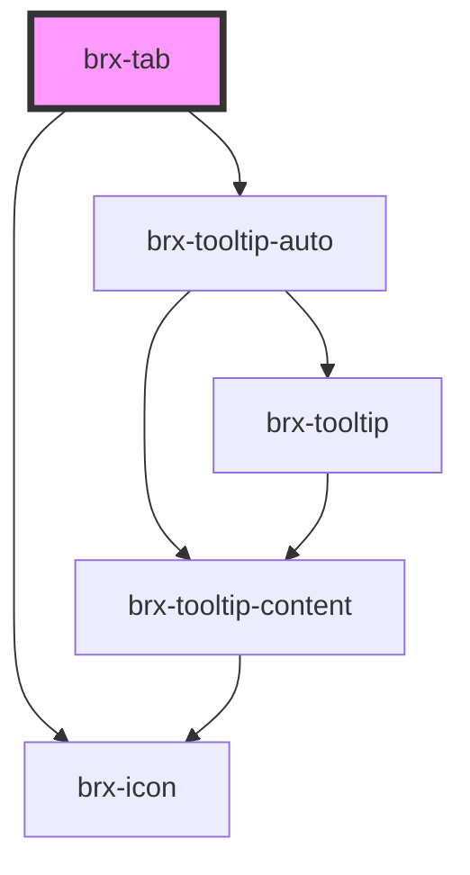

# brx-tab-tooltip

<!-- Auto Generated Below -->

## Properties

| Property      | Attribute      | Description | Type      | Default     |
| ------------- | -------------- | ----------- | --------- | ----------- |
| `counter`     | `counter`      |             | `boolean` | `undefined` |
| `iconName`    | `icon-name`    |             | `string`  | `undefined` |
| `label`       | `label`        |             | `string`  | `undefined` |
| `tabTitle`    | `tab-title`    |             | `string`  | `undefined` |
| `tooltipText` | `tooltip-text` |             | `string`  | `undefined` |
| `value`       | `value`        |             | `string`  | `undefined` |

## Methods

### `setActive(active: boolean) => Promise<void>`

#### Returns

Type: `Promise<void>`

## Dependencies

### Depends on

- [brx-tooltip-auto](../brx-tooltip-auto)
- [brx-icon](../brx-icon)

### Graph

----------------------------------------------

*Built with [StencilJS](https://stenciljs.com/)*
