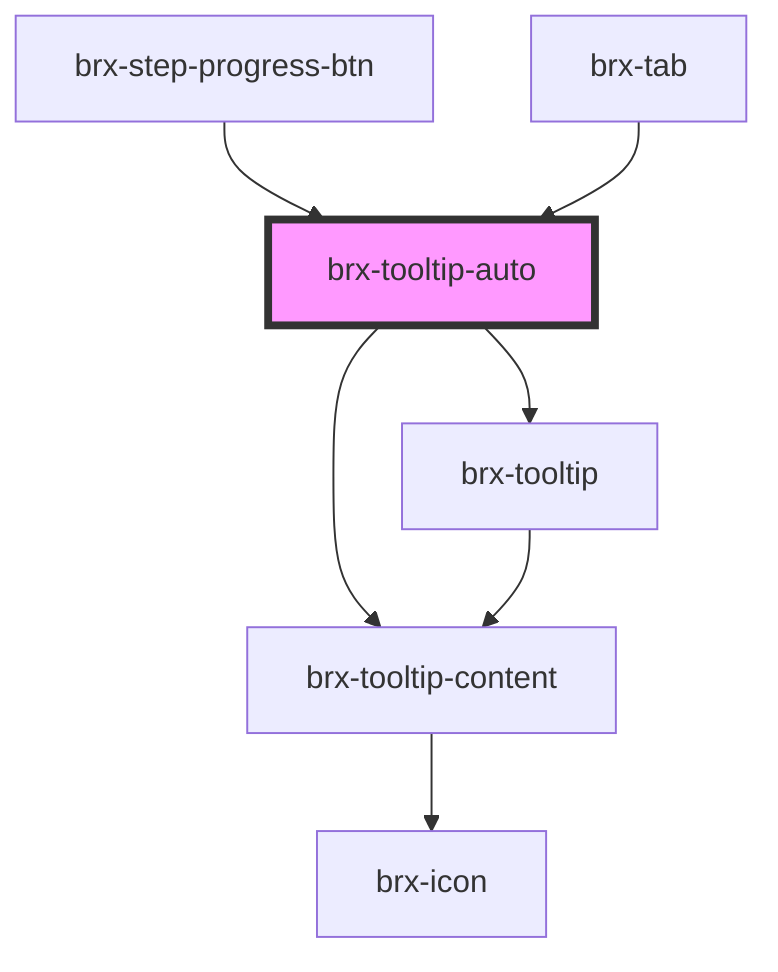

# brx-tooltip-auto

<!-- Auto Generated Below -->

## Properties

| Property      | Attribute      | Description | Type                                     | Default     |
| ------------- | -------------- | ----------- | ---------------------------------------- | ----------- |
| `place`       | `place`        |             | `"bottom" \| "left" \| "right" \| "top"` | `'bottom'`  |
| `tooltipText` | `tooltip-text` |             | `string`                                 | `undefined` |

## Dependencies

### Used by

 - [brx-step-progress-btn](../brx-step-progress-btn)
 - [brx-tab](../brx-tab)

### Depends on

- [brx-tooltip](../brx-tooltip)
- [brx-tooltip-content](../brx-tooltip-content)

### Graph

----------------------------------------------

*Built with [StencilJS](https://stenciljs.com/)*
