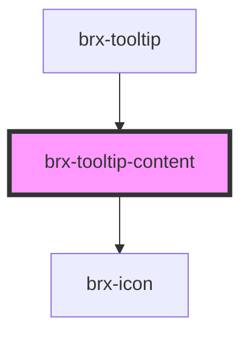

# brx-tooltip-content

<!-- Auto Generated Below -->

## Properties

| Property  | Attribute | Description | Type      | Default     |
| --------- | --------- | ----------- | --------- | ----------- |
| `color`   | `color`   |             | `string`  | `'info'`    |
| `place`   | `place`   |             | `string`  | `undefined` |
| `popover` | `popover` |             | `boolean` | `undefined` |

## Dependencies

### Used by

 - [brx-tooltip](../brx-tooltip)

### Depends on

- [brx-icon](../brx-icon)

### Graph

----------------------------------------------

*Built with [StencilJS](https://stenciljs.com/)*
