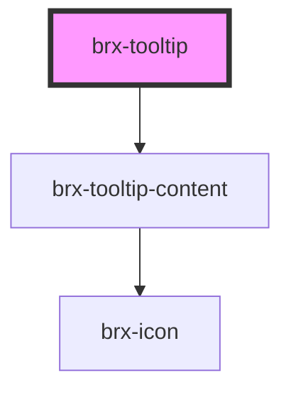

# brx-tooltip

<!-- Auto Generated Below -->

## Properties

| Property  | Attribute | Description | Type                                     | Default     |
| --------- | --------- | ----------- | ---------------------------------------- | ----------- |
| `active`  | `active`  |             | `boolean`                                | `false`     |
| `color`   | `color`   |             | `string`                                 | `'info'`    |
| `place`   | `place`   |             | `"bottom" \| "left" \| "right" \| "top"` | `'top'`     |
| `popover` | `popover` |             | `boolean`                                | `false`     |
| `target`  | `target`  |             | `HTMLElement \| string`                  | `undefined` |
| `text`    | `text`    |             | `string`                                 | `undefined` |
| `timer`   | `timer`   |             | `number`                                 | `undefined` |
| `type`    | `type`    |             | `string`                                 | `'info'`    |

## Dependencies

### Depends on

- [brx-tooltip-content](../brx-tooltip-content)

### Graph

----------------------------------------------

*Built with [StencilJS](https://stenciljs.com/)*
