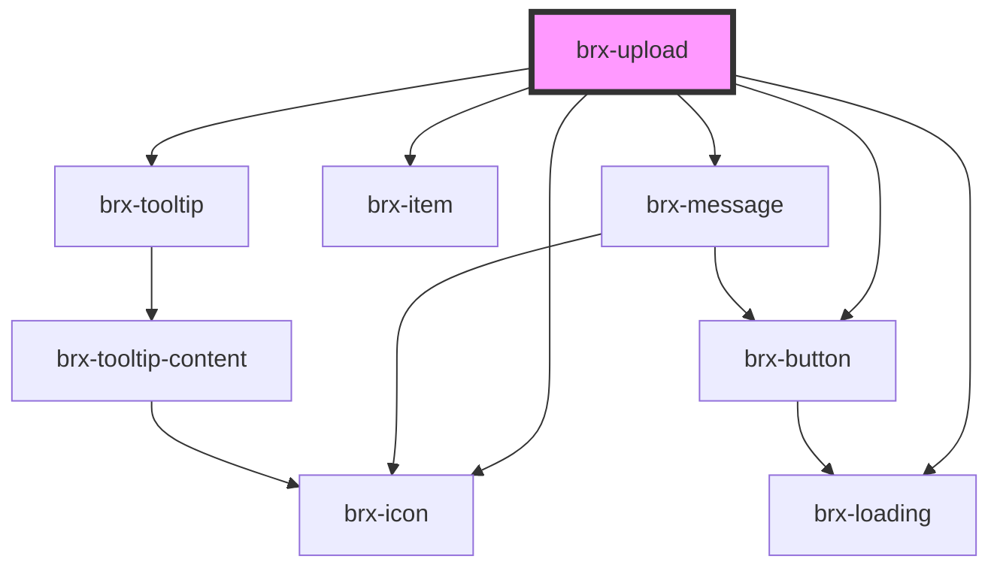

# brx-upload

<!-- Auto Generated Below -->

## Properties

| Property            | Attribute      | Description                                                                                                                                                                                                                                                                                                                                    | Type                                                          | Default                       |
| ------------------- | -------------- | ---------------------------------------------------------------------------------------------------------------------------------------------------------------------------------------------------------------------------------------------------------------------------------------------------------------------------------------------- | ------------------------------------------------------------- | ----------------------------- |
| `accept`            | `accept`       | If the value of the type attribute is `"file"`, then this attribute will indicate the types of files that the server accepts, otherwise it will be ignored. The value must be a comma-separated list of unique content type specifiers.                                                                                                        | `string`                                                      | `undefined`                   |
| `autofocus`         | `autofocus`    | This Boolean attribute lets you specify that a form control should have input focus when the page loads.                                                                                                                                                                                                                                       | `boolean`                                                     | `false`                       |
| `disabled`          | `disabled`     |                                                                                                                                                                                                                                                                                                                                                | `boolean`                                                     | `false`                       |
| `handleUploadFiles` | --             |                                                                                                                                                                                                                                                                                                                                                | `(asset: AttachmentAsset, position: number) => Promise<void>` | `DEFAULT_HANDLE_UPLOAD_FILES` |
| `hiddenLabel`       | `hidden-label` |                                                                                                                                                                                                                                                                                                                                                | `boolean`                                                     | `undefined`                   |
| `inputId`           | `input-id`     |                                                                                                                                                                                                                                                                                                                                                | `string`                                                      | `undefined`                   |
| `label`             | `label`        |                                                                                                                                                                                                                                                                                                                                                | `string`                                                      | `undefined`                   |
| `labelClass`        | `label-class`  |                                                                                                                                                                                                                                                                                                                                                | `string`                                                      | `undefined`                   |
| `multiple`          | `multiple`     |                                                                                                                                                                                                                                                                                                                                                | `boolean`                                                     | `false`                       |
| `name`              | `name`         | The name of the control, which is submitted with the form data.                                                                                                                                                                                                                                                                                | `string`                                                      | `undefined`                   |
| `readonly`          | `readonly`     | If `true`, the user cannot modify the value.                                                                                                                                                                                                                                                                                                   | `boolean`                                                     | `false`                       |
| `required`          | `required`     | If `true`, the user must fill in a value before submitting a form.                                                                                                                                                                                                                                                                             | `boolean`                                                     | `false`                       |
| `size`              | `size`         | The initial size of the control. This value is in pixels unless the value of the type attribute is `"text"` or `"password"`, in which case it is an integer number of characters. This attribute applies only when the `type` attribute is set to `"text"`, `"search"`, `"tel"`, `"url"`, `"email"`, or `"password"`, otherwise it is ignored. | `number`                                                      | `undefined`                   |
| `spellcheck`        | `spellcheck`   | If `true`, the element will have its spelling and grammar checked.                                                                                                                                                                                                                                                                             | `boolean`                                                     | `false`                       |
| `status`            | `status`       |                                                                                                                                                                                                                                                                                                                                                | `"danger" \| "info" \| "success" \| "warning"`                | `undefined`                   |
| `step`              | `step`         | Works with the min and max attributes to limit the increments at which a value can be set. Possible values are: `"any"` or a positive floating point number.                                                                                                                                                                                   | `string`                                                      | `undefined`                   |
| `value`             | --             |                                                                                                                                                                                                                                                                                                                                                | `AttachmentAsset[]`                                           | `null`                        |

## Events

| Event       | Description | Type                                   |
| ----------- | ----------- | -------------------------------------- |
| `brxChange` |             | `CustomEvent<UploadChangeEventDetail>` |

## Methods

### `getAttachmentAssets() => Promise<AttachmentAsset[]>`

#### Returns

Type: `Promise<AttachmentAsset[]>`

## Dependencies

### Depends on

- [brx-icon](../brx-icon)
- [brx-message](../brx-message)
- [brx-item](../brx-item)
- [brx-tooltip](../brx-tooltip)
- [brx-button](../brx-button)
- [brx-loading](../brx-loading)

### Graph

----------------------------------------------

*Built with [StencilJS](https://stenciljs.com/)*
